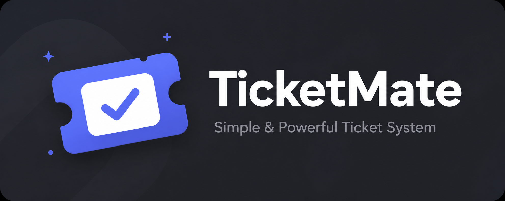
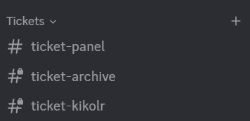

<div align="center">
  

  <h1>TicketMate</h1>
  <p>A simple, clean, and reliable Discord ticket bot powered by Firebase.</p>

  <a href="https://discord.com/oauth2/authorize?client_id=1518488281380028506&permissions=395405544464&integration_type=0&scope=bot+applications.commands">
    
  </a>
  <a href="https://github.com/hanzlr/ticketmate-bot/blob/main/LICENSE">
    
  </a>
  <a href="https://github.com/hanzlr/ticketmate-bot/releases">
    
  </a>
  <a href="https://github.com/hanzlr/ticketmate-bot/issues">
    
  </a>

</div>

---

## ✨ Features

- 🎫 **One-click ticket creation** via button panel
- 🔒 **Private ticket channels** — only the user, bot, and admins can see
- 👥 **Add / Remove users** from a ticket
- 📁 **Auto transcript** saved to archive channel when ticket is closed
- ♻️ **Auto-recreate** panel and archive channel if deleted
- ☁️ **Firebase Firestore** for persistent data storage
- ⚡ **Slash commands** powered by Discord.js v14

---

## 📸 Preview

> After running `/setup`, TicketMate automatically creates the category and all required channels.

<div align="center">
  
</div>

---

## 🚀 Invite TicketMate

The easiest way — just invite the bot to your server and run `/setup`. No hosting required!

**[👉 Click here to invite TicketMate](https://discord.com/oauth2/authorize?client_id=1518488281380028506&permissions=395405544464&integration_type=0&scope=bot+applications.commands)**

---

## 🛠️ Self-Hosting

Prefer to host your own instance? Follow the steps below.

### Prerequisites

- [Node.js](https://nodejs.org/) v18 or higher
- A [Discord Application](https://discord.com/developers/applications) with a bot token
- A [Firebase](https://firebase.google.com/) project with Firestore enabled

### 1. Clone the repository

```bash
git clone https://github.com/hanzlr/ticketmate-bot.git
cd ticketmate
```

### 2. Install dependencies

```bash
npm install
```

### 3. Configure environment variables

Create a `.env` file in the root directory:

```env
DISCORD_TOKEN=your_bot_token_here
CLIENT_ID=your_client_id_here
```

### 4. Set up Firebase

1. Go to [Firebase Console](https://console.firebase.google.com/) and create a new project
2. Once inside your project, go to **Build → Firestore Database** and click **Create database**
   - Choose **Start in production mode**
   - Pick any location closest to you
3. Go to **Project Settings** (gear icon) → **Service accounts** tab
4. Click **Generate new private key** → confirm → a JSON file will download
5. Rename that file to `serviceAccount.json` and place it in the root of the project

> ⚠️ **Never commit `serviceAccount.json` to GitHub.** It contains your private credentials. It's already listed in `.gitignore` by default.

### 5. Register slash commands

```bash
node deploy.js
```

### 6. Start the bot

```bash
npm start
```

### 7. Set up TicketMate in your server

Once the bot is online, run `/setup` in any channel. TicketMate will automatically create:

| Channel | Description |
|---|---|
| `📁 Tickets` | Category that holds all ticket channels |
| `#ticket-panel` | Public channel with the Open Ticket button |
| `#ticket-archive` | Private channel where transcripts are saved |

---

## 📋 Commands

| Command | Description | Permission |
|---|---|---|
| `/setup` | Set up TicketMate in your server | Manage Server |
| `/reset` | Reset TicketMate configuration | Manage Server |
| `/add @user` | Add a user to the current ticket | Inside ticket |
| `/remove @user` | Remove a user from the current ticket | Inside ticket |
| `/ticket` | Manually create a ticket | Anyone |
| `/help` | Show all available commands | Anyone |

---

## 🗂️ Project Structure

```
ticketmate/
├── src/
│   ├── commands/
│   │   ├── add.js
│   │   ├── help.js
│   │   ├── remove.js
│   │   ├── reset.js
│   │   ├── setup.js
│   │   └── ticket.js
│   ├── events/
│   │   ├── channelDelete.js
│   │   ├── interactionCreate.js
│   │   └── ready.js
│   ├── handlers/
│   │   └── ticketHandler.js
│   └── firebase.js
├── assets/
├── .env
├── deploy.js
├── index.js
├── package.json
└── serviceAccount.json
```

---

## 🤝 Contributing

Contributions are welcome! Please read [CONTRIBUTING.md](CONTRIBUTING.md) before submitting a pull request.

---

## 🔒 Security

Found a vulnerability? Please read [SECURITY.md](SECURITY.md) and report it responsibly.

---

## 📄 License

This project is licensed under the [MIT License](LICENSE).

---

## 📜 Legal

- [Terms of Service](https://github.com/hanzlr/ticketmate-docs/blob/main/terms-of-service.md)
- [Privacy Policy](https://github.com/hanzlr/ticketmate-docs/blob/main/privacy-policy.md)

---

<div align="center">
  Made by <a href="https://github.com/hanzlr">hanzlr</a>
</div>